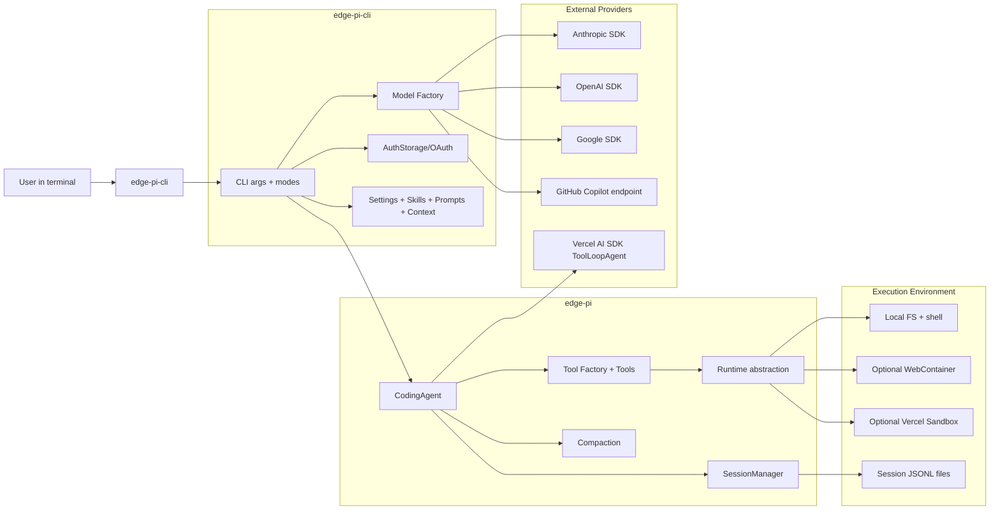

# Package Interaction Architecture

```mermaid
flowchart LR
    U[User in terminal] --> CLI[edge-pi-cli]

    subgraph CLI_PKG [edge-pi-cli]
        A[CLI args + modes]
        B[Model Factory]
        C[AuthStorage/OAuth]
        D[Settings + Skills + Prompts + Context]
    end

    subgraph CORE_PKG [edge-pi]
        E[CodingAgent]
        F[Tool Factory + Tools]
        G[SessionManager]
        H[Compaction]
        I[Runtime abstraction]
    end

    subgraph PROVIDERS [External Providers]
        J[Anthropic SDK]
        K[OpenAI SDK]
        L[Google SDK]
        M[GitHub Copilot endpoint]
        N[Vercel AI SDK ToolLoopAgent]
    end

    subgraph HOST [Execution Environment]
        O[Local FS + shell]
        P[Optional WebContainer]
        Q[Optional Vercel Sandbox]
        R[Session JSONL files]
    end

    CLI --> A
    A --> B
    A --> C
    A --> D
    A --> E

    B --> J
    B --> K
    B --> L
    B --> M

    E --> N
    E --> F
    E --> G
    E --> H
    F --> I
    I --> O
    I --> P
    I --> Q
    G --> R
```
