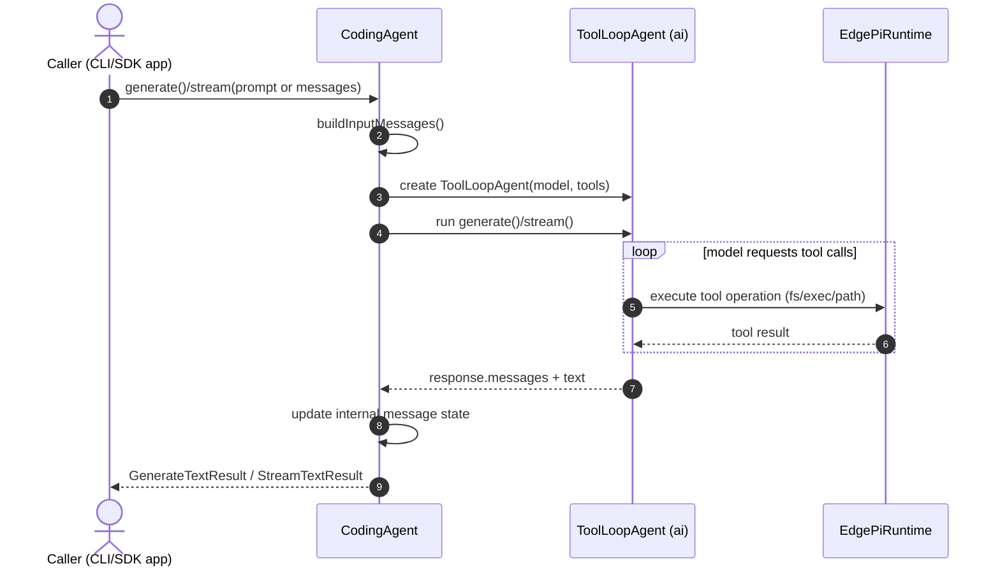
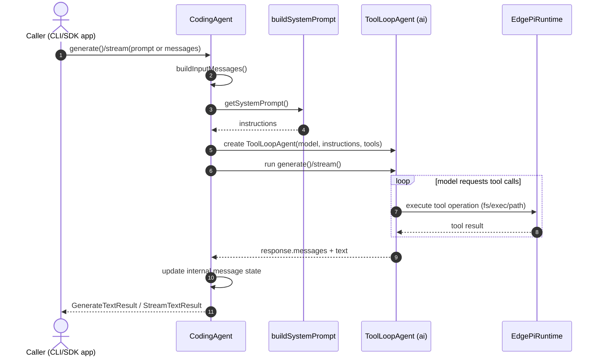
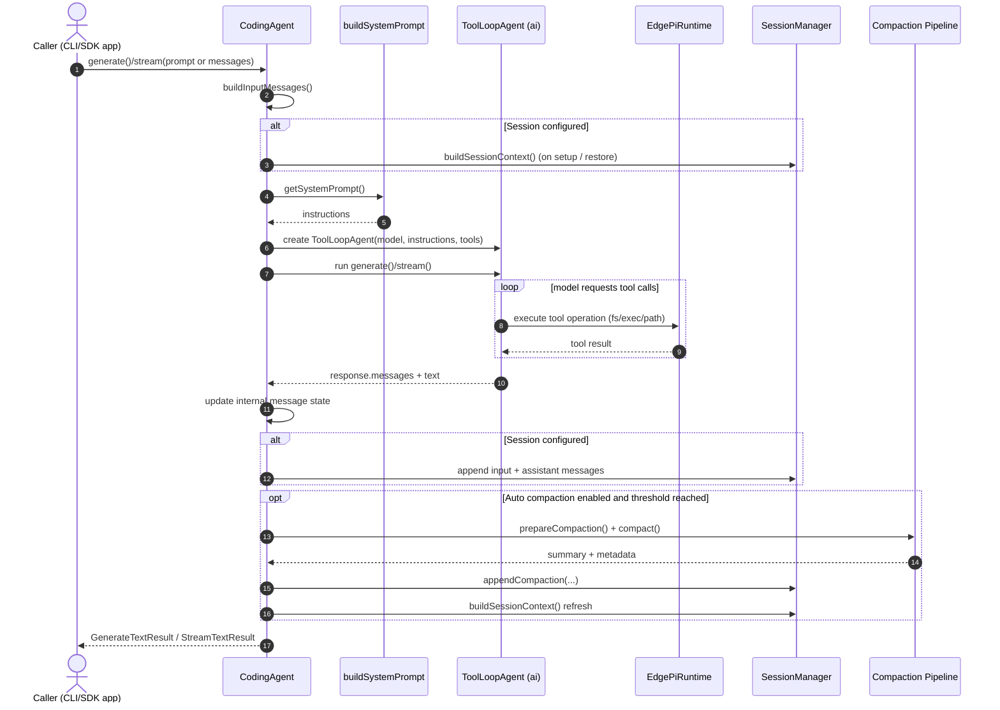

# edge-pi Architecture

## CodingAgent v1 (minimal)

```mermaid
sequenceDiagram
    autonumber
    actor App as Caller (CLI/SDK app)
    participant CA as CodingAgent
    participant TL as ToolLoopAgent (ai)
    participant RT as EdgePiRuntime

    App->>CA: generate()/stream(prompt or messages)
    CA->>CA: buildInputMessages()
    CA->>TL: create ToolLoopAgent(model, tools)
    CA->>TL: run generate()/stream()

    loop model requests tool calls
        TL->>RT: execute tool operation (fs/exec/path)
        RT-->>TL: tool result
    end

    TL-->>CA: response.messages + text
    CA->>CA: update internal message state
    CA-->>App: GenerateTextResult / StreamTextResult
```

## CodingAgent v2 (+ system prompt builder)

```mermaid
sequenceDiagram
    autonumber
    actor App as Caller (CLI/SDK app)
    participant CA as CodingAgent
    participant SP as buildSystemPrompt
    participant TL as ToolLoopAgent (ai)
    participant RT as EdgePiRuntime

    App->>CA: generate()/stream(prompt or messages)
    CA->>CA: buildInputMessages()
    CA->>SP: getSystemPrompt()
    SP-->>CA: instructions
    CA->>TL: create ToolLoopAgent(model, instructions, tools)
    CA->>TL: run generate()/stream()

    loop model requests tool calls
        TL->>RT: execute tool operation (fs/exec/path)
        RT-->>TL: tool result
    end

    TL-->>CA: response.messages + text
    CA->>CA: update internal message state
    CA-->>App: GenerateTextResult / StreamTextResult
```

## CodingAgent v3 (+ session and compaction)

```mermaid
sequenceDiagram
    autonumber
    actor App as Caller (CLI/SDK app)
    participant CA as CodingAgent
    participant SP as buildSystemPrompt
    participant TL as ToolLoopAgent (ai)
    participant RT as EdgePiRuntime
    participant SM as SessionManager
    participant CP as Compaction Pipeline

    App->>CA: generate()/stream(prompt or messages)
    CA->>CA: buildInputMessages()
    alt Session configured
        CA->>SM: buildSessionContext() (on setup / restore)
    end
    CA->>SP: getSystemPrompt()
    SP-->>CA: instructions
    CA->>TL: create ToolLoopAgent(model, instructions, tools)
    CA->>TL: run generate()/stream()

    loop model requests tool calls
        TL->>RT: execute tool operation (fs/exec/path)
        RT-->>TL: tool result
    end

    TL-->>CA: response.messages + text
    CA->>CA: update internal message state

    alt Session configured
        CA->>SM: append input + assistant messages
    end

    opt Auto compaction enabled and threshold reached
        CA->>CP: prepareCompaction() + compact()
        CP-->>CA: summary + metadata
        CA->>SM: appendCompaction(...)
        CA->>SM: buildSessionContext() refresh
    end

    CA-->>App: GenerateTextResult / StreamTextResult
```
